# Домашнее задание по теме "Система мониторинга Zabbix. Часть 2" Ячмень Марк Викторович

## Задание 1

**Создайте свой шаблон, в котором будут элементы данных, мониторящие загрузку CPU и RAM хоста.**

#### Процесс выполнения
1. Выполняя ДЗ сверяйтесь с процессом отражённым в записи лекции.
2. В веб-интерфейсе Zabbix Servera в разделе Templates создайте новый шаблон.
3. Создайте Item который будет собирать информацию об загрузке CPU в процентах.
4. Создайте Item который будет собирать информацию об загрузке RAM в процентах.

**Требования к результатату**

Прикрепите в файл README.md скриншот страницы шаблона с названием «Задание 1»

## Решение 1

Для выполнения задания выполним следующие действия.

Откроем web-панель Zabbix и перейдём в раздел *Data Collection > Templates*:

Для создания нового шаблона (template), нажмём кнопку *Create template*:

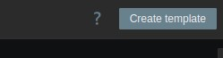

В открывшейся форме заполним необходимые поля и нажмём кнопку *Add*:

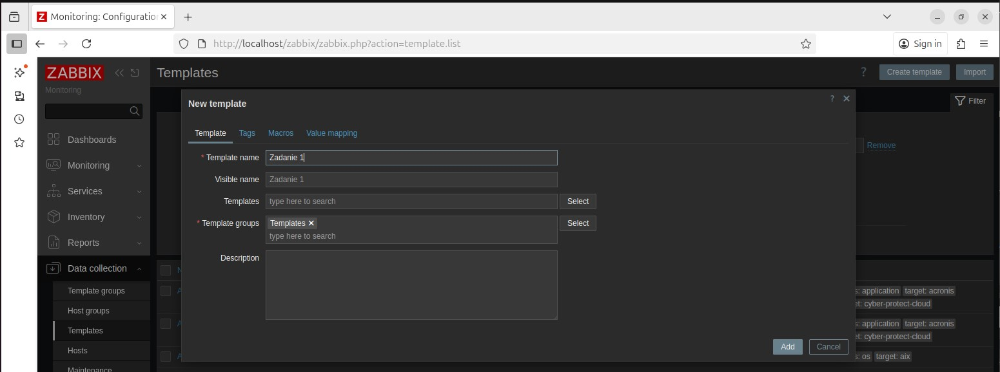

После создания шаблона перейдём к его редактированию, а именно к созданию необходимых Items внутри шаблона.
Для этого выберем наш шаблон и щёлкнем по разделу *Items*:

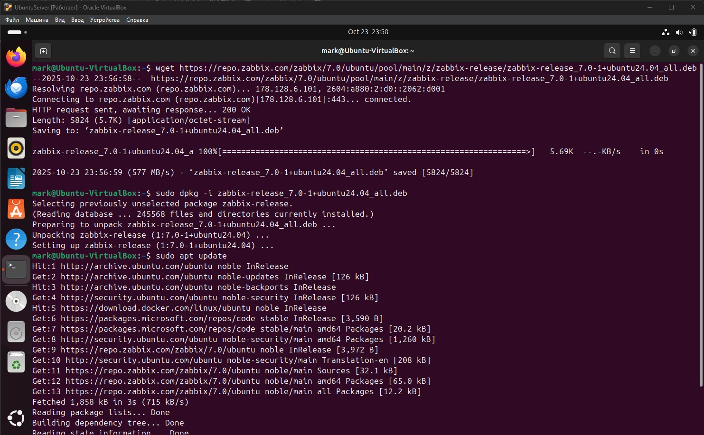

Для создания Item щёлкнем по кнопке *Create  item*:

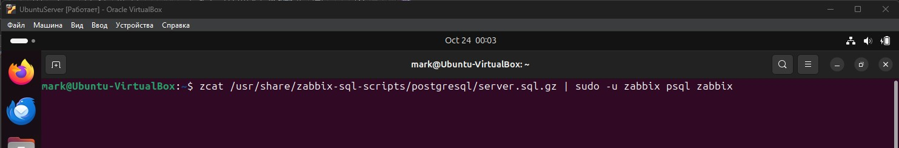

В открывшейся форме редактирования Item заполним необходимые поля, в частносьти в поле *Key* выберем сбор данных о CPU:

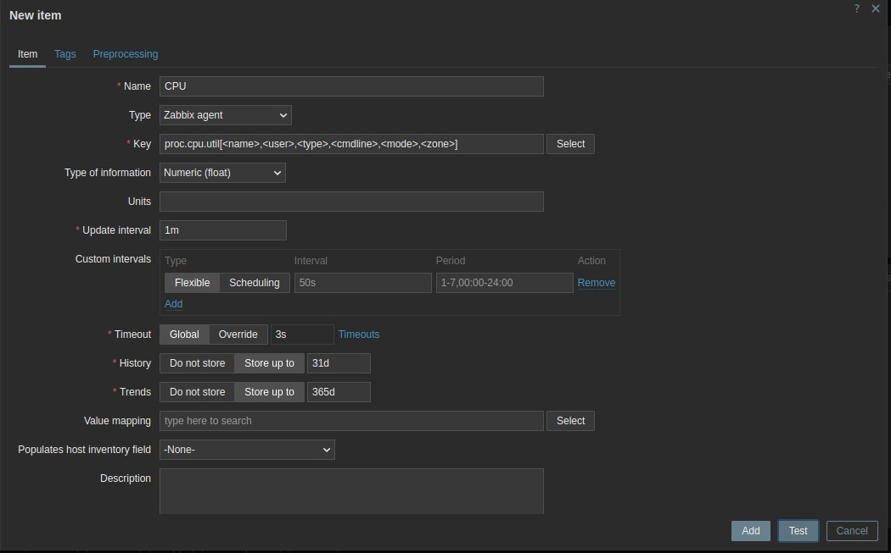

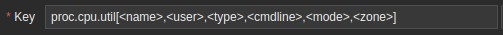

Нажмём кнопку *Add* для добавления Item.

Проделаем аналогичную операцию для создания второго Item для сбора информации о загрузке RAM.
При создании этого Item в поле Key выберем сбор информации о RAM:

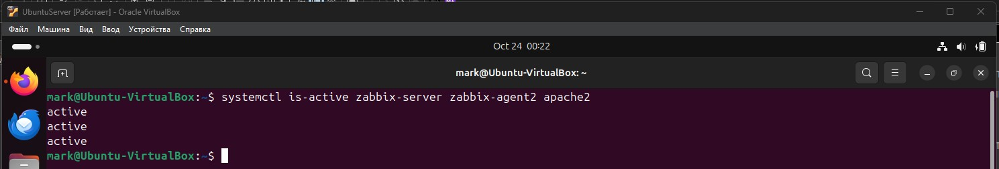

## Задание 2

**Добавьте в Zabbix два хоста и задайте им имена <фамилия и инициалы-1> и <фамилия и инициалы-2>. Например: ivanovii-1 и ivanovii-2.**

#### Процесс выполнения

1. Выполняя ДЗ сверяйтесь с процессом отражённым в записи лекции.
2. Установите Zabbix Agent на 2 виртмашины, одной из них может быть ваш Zabbix Server.
3. Добавьте Zabbix Server в список разрешенных серверов ваших Zabbix Agentов.
4. Добавьте Zabbix Agentов в раздел Configuration > Hosts вашего Zabbix Servera.
5. Прикрепите за каждым хостом шаблон Linux by Zabbix Agent.
6. Проверьте что в разделе Latest Data начали появляться данные с добавленных агентов.

**Требования к результатам**

Результат данного задания сдавайте вместе с заданием 3

## Решение 2

Это задание является повторением задания из первой части, но в немного изменённом виде.
В первой части задания нами уже было создано два хоста, но в Zabbix они сейчас отображаются со своими системными именами:

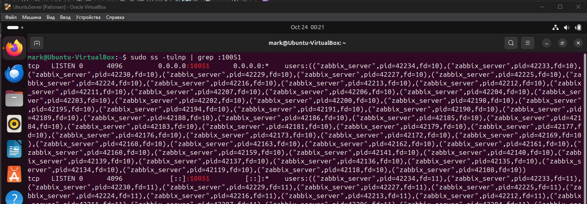

Для того, чтобы привести имена отображаемых хостов в соответствие с текущим заданием требуется выполнить следующее.
Щёлкнем по имени одного из хостов и в выпадающем меню выберем пункт Host:

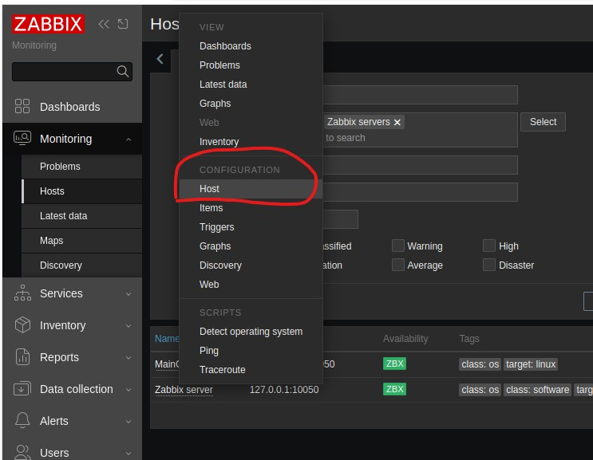

Щёлкнув по указанному выше пункту попадём в форму редактирования хоста, где изменим поле *Host name*:

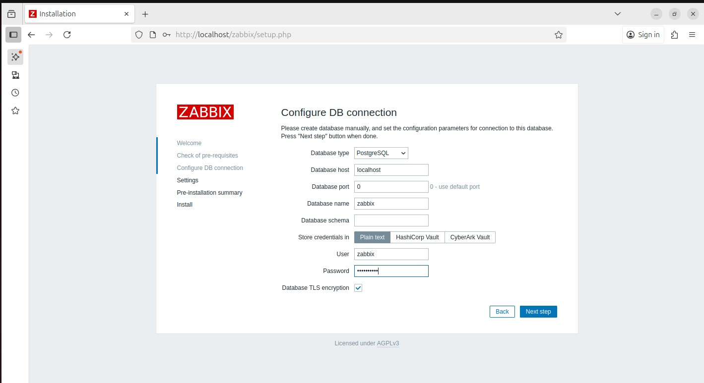

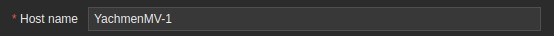

После окончания редактирования щёлкнем по кнопке *Update*:

Произведём аналогичные операции со вторым хостом:

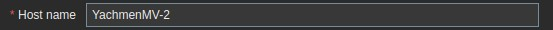

Теперь мы видим, что хосты стали отображаться с новыми именами:

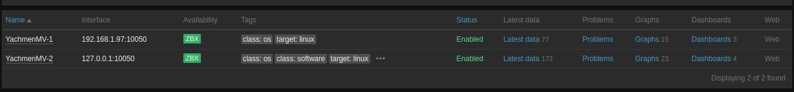

## Задание 3

**Привяжите созданный шаблон к двум хостам. Также привяжите к обоим хостам шаблон Linux by Zabbix Agent.**

#### Процесс выполнения

1. Выполняя ДЗ сверяйтесь с процессом отражённым в записи лекции.
2. Зайдите в настройки каждого хоста и в разделе Templates прикрепите к этому хосту ваш шаблон.
3. Так же к каждому хосту привяжите шаблон Linux by Zabbix Agent.
4. Проверьте что в раздел Latest Data начали поступать необходимые данные из вашего шаблона.

**Требования к результатам**

Прикрепите в файл README.md скриншот страницы хостов, где будут видны привязки шаблонов с названиями «Задание 2-3». 
Хосты должны иметь зелёный статус подключения.

## Решение 3

Для выполнения задания выполним следующие действия.

Снова перейдём в редактирование свойств хоста, как в предыдущем задании.
На этот раз нам нужно отредактировать раздел *Templates*:

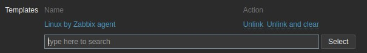

Щёлкнем кнопку Select и выберем созданный в первом задании шаблон:

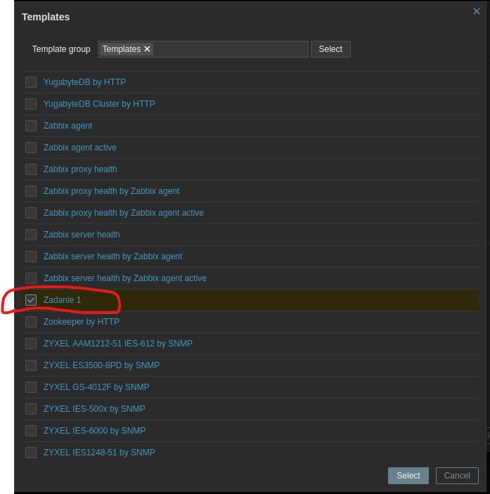

Для сохранения щёлкнем кнопку *Update*.

Повторим те же самые действия со вторым хостом.

Для того, чтобы увидеть, что хосты привязались к созданному нами шаблону перейдём в раздел *Data collection > Templates*, найдём созданный нами шаблон
и щёлкнем по разделу *Hosts*:

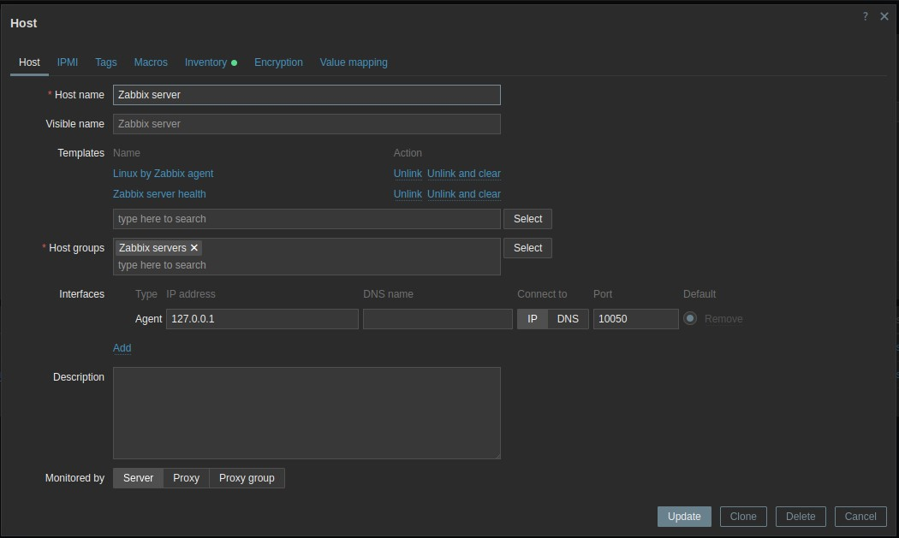

На открывшейся странице увидим оба наших привязанных хоста:

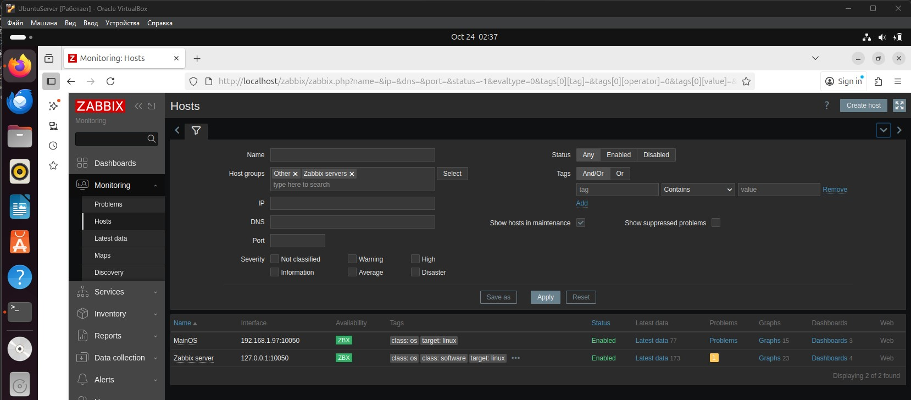

Для того, чтобы увидеть, что параметры CPU и RAM отображаются, перейдём в раздел *Monitoring - Latest data*.
На открывшейся странице можно увидеть параметры утилизации RAM:

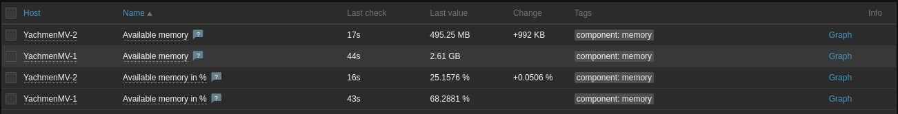

и параметры утилизации CPU:

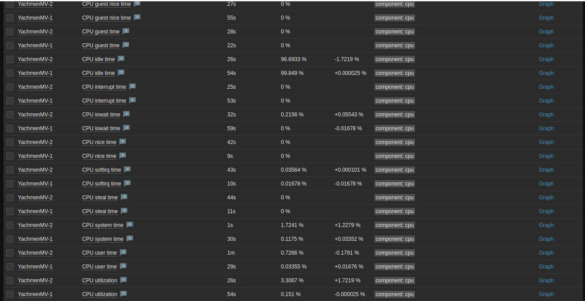

## Задание 4

**Создайте свой кастомный дашборд.**

#### Процесс выполнения

1. Выполняя ДЗ сверяйтесь с процессом отражённым в записи лекции.
2. В разделе Dashboards создайте новый дашборд.
3. Разместите на нём несколько графиков на ваше усмотрение.

**Требования к результатам**

Прикрепите в файл README.md скриншот дашборда с названием «Задание 4».

## Решение 4

Для выполнения задания выполним следующие действия.

Перейдём в раздел *Dashboards*:

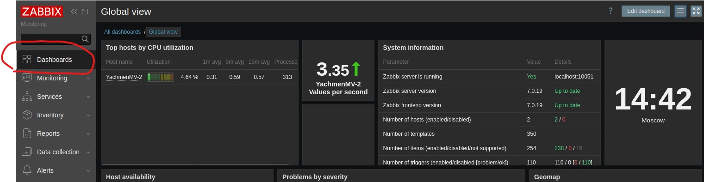

Щёлкнем по кнопке *Actions* и выберем пункт *Create new*:

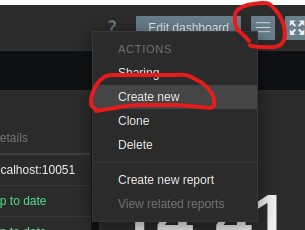

В окне редактирования свойств нового Dashboard заполним необходимые поля (наш Dashboard будет отображать график утилизации RAM на хостах):

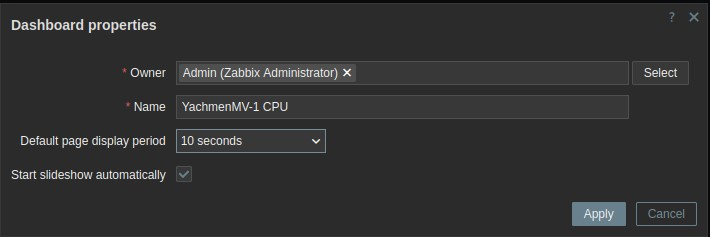

В следующем окне, в секции *Data set* в разделе *Host patterns* добавим хосты, данные с которых мы хотим отображать на графике:

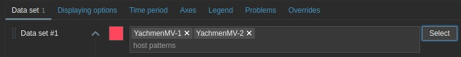

А в разделе *item patterns* добавим параметр, который хотим отображать на графике (в нашем случае *Available memori in %*):

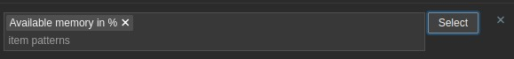

Щёлкнем кнопку *Add* для добавления графика на наш Dashboard:

После этого мы сможем увидеть созданный нами Dashboard с графиком:

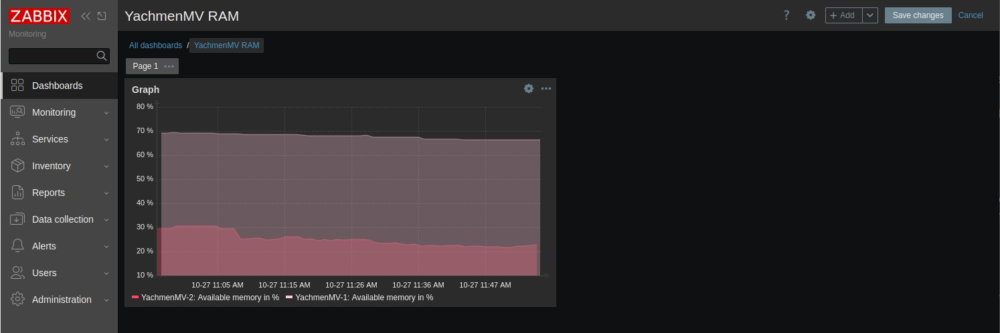