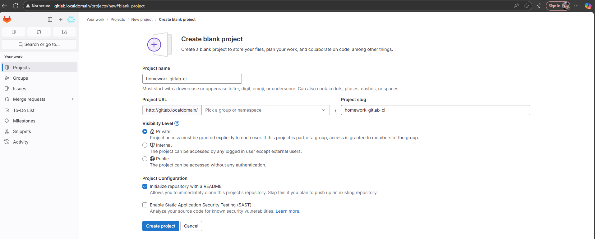
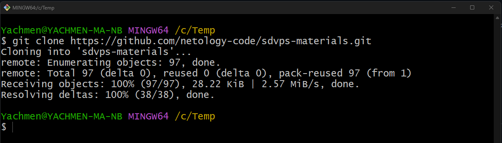
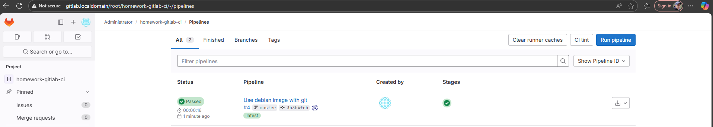
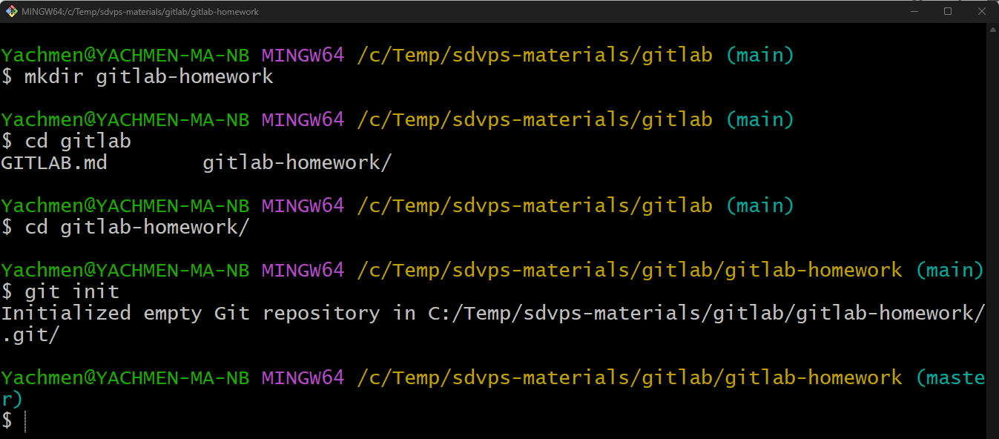

# Домашнее задание по теме "Disaster recovery и Keepalived" Ячмень Марк Викторович

## Задание 1

 - Дана схема для Cisco Packet Tracer, рассматриваемая в лекции.
 - На данной схеме уже настроено отслеживание интерфейсов маршрутизаторов Gi0/1 (для нулевой группы)
 - Необходимо аналогично настроить отслеживание состояния интерфейсов Gi0/0 (для первой группы).
 - Для проверки корректности настройки, разорвите один из кабелей между одним из маршрутизаторов и Switch0 и запустите ping между PC0 и Server0.
 - На проверку отправьте получившуюся схему в формате pkt и скриншот, где виден процесс настройки маршрутизатора.

## Решение 1

Для выполнения задания выполним следующие действия.

Установим Vagrant на свой компьютер:

## Задание 2

Что нужно сделать:

1. Запушьте репозиторий на GitLab, изменив origin. Это изучалось на занятии по Git.
2. Создайте .gitlab-ci.yml, описав в нём все необходимые, на ваш взгляд, этапы.

В качестве ответа в шаблон с решением добавьте:

* файл gitlab-ci.yml для своего проекта или вставьте код в соответствующее поле в шаблоне;
* скриншоты с успешно собранными сборками.

## Решение 2

Для выполнения задания подготовим локальный репозиторий.
Для этого в консоли выполним команды:

В созданной папке создадим файл .gitlab-ci.yml со следующим содержанием:

Теперь выполним push локального репозитория в репозиторий GitLab:

После этого перейдём в web-интерфейс GitLab и увидим, что job выполнился:

В логах можем увидеть сообщение об успешном запуске:

