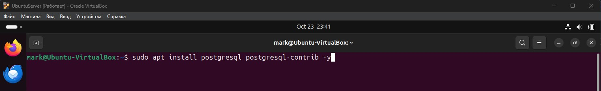
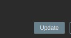

# Домашнее задание по теме "Система мониторинга Zabbix" Ячмень Марк Викторович

## Задание 1

**Создайте свой шаблон, в котором будут элементы данных, мониторящие загрузку CPU и RAM хоста.**

#### Процесс выполнения
1. Выполняя ДЗ сверяйтесь с процессом отражённым в записи лекции.
2. В веб-интерфейсе Zabbix Servera в разделе Templates создайте новый шаблон.
3. Создайте Item который будет собирать информацию об загрузке CPU в процентах.
4. Создайте Item который будет собирать информацию об загрузке RAM в процентах.

**Требования к результатату**

Прикрепите в файл README.md скриншот страницы шаблона с названием «Задание 1»

## Решение 1

Для выполнения задания выполним следующие действия.

Откроем web-панель Zabbix и перейдём в раздел *Data Collection:

## Задание 2

**Добавьте в Zabbix два хоста и задайте им имена <фамилия и инициалы-1> и <фамилия и инициалы-2>. Например: ivanovii-1 и ivanovii-2.**

#### Процесс выполнения

1. Выполняя ДЗ сверяйтесь с процессом отражённым в записи лекции.
2. Установите Zabbix Agent на 2 виртмашины, одной из них может быть ваш Zabbix Server.
3. Добавьте Zabbix Server в список разрешенных серверов ваших Zabbix Agentов.
4. Добавьте Zabbix Agentов в раздел Configuration > Hosts вашего Zabbix Servera.
5. Прикрепите за каждым хостом шаблон Linux by Zabbix Agent.
6. Проверьте что в разделе Latest Data начали появляться данные с добавленных агентов.

**Требования к результатам**

Результат данного задания сдавайте вместе с заданием 3

## Решение 2

Для выполнения задания выполним следующие действия.

Т.к. в процессе установки Zabbix сервер мы одновременно установили и агента, то приступим к установке агента на второй сервер:

## Задание 3

**Привяжите созданный шаблон к двум хостам. Также привяжите к обоим хостам шаблон Linux by Zabbix Agent.**

#### Процесс выполнения

1. Выполняя ДЗ сверяйтесь с процессом отражённым в записи лекции.
2. Зайдите в настройки каждого хоста и в разделе Templates прикрепите к этому хосту ваш шаблон.
3. Так же к каждому хосту привяжите шаблон Linux by Zabbix Agent.
4. Проверьте что в раздел Latest Data начали поступать необходимые данные из вашего шаблона.

**Требования к результатам**

Прикрепите в файл README.md скриншот страницы хостов, где будут видны привязки шаблонов с названиями «Задание 2-3». Хосты должны иметь зелёный статус подключения.

## Решение 3

Для выполнения задания выполним следующие действия.

Т.к. в процессе установки Zabbix сервер мы одновременно установили и агента, то приступим к установке агента на второй сервер:

