# Домашнее задание по теме "Хранение в K8s" Ячмень Марк Викторович

## Задание 1. Volume: обмен данными между контейнерами в поде

Создать Deployment приложения, состоящего из двух контейнеров, обменивающихся данными.

## Решение 1

Подготовим окружение.

Для выполнения домашнего задания будем использовать виртуальную машину `k8s-lab` с MicroK8s, подготовленную в рамках предыдущей домашней работы.

После запуска виртуальной машины проверено состояние кластера:

```
microk8s status --wait-ready
microk8s kubectl get nodes -o wide
microk8s kubectl get pods -A
```

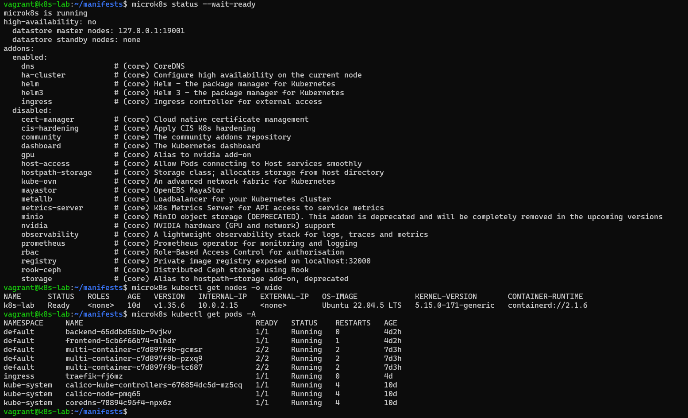

MicroK8s запущен, нода `k8s-lab` находится в состоянии `Ready`. 
Системные компоненты Kubernetes находятся в состоянии `Running`.

Также проверим наличие свободного дискового пространства:

```
df -h
```

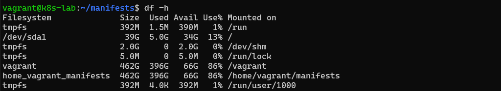

На системном разделе виртуальной машины доступно около 34 ГБ свободного пространства, чего достаточно для выполнения задания.

Перед выполнением текущей домашней работы удалим ресурсы, оставшиеся после предыдущего задания:

```
microk8s kubectl delete -f deployment-multi-container.yaml
microk8s kubectl delete -f service-clusterip.yaml
microk8s kubectl delete -f deployment-backend.yaml
microk8s kubectl delete -f deployment-frontend.yaml
microk8s kubectl delete -f service-backend.yaml
microk8s kubectl delete -f service-frontend.yaml
microk8s kubectl delete -f ingress.yaml
microk8s kubectl delete -f middleware-strip-api.yaml
microk8s kubectl delete -f service-nodeport.yaml
```

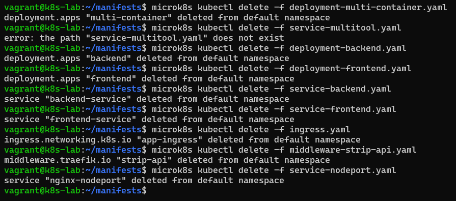

После удаления проверим состояние namespace `default`:

```
microk8s kubectl get all
microk8s kubectl get ingress
```

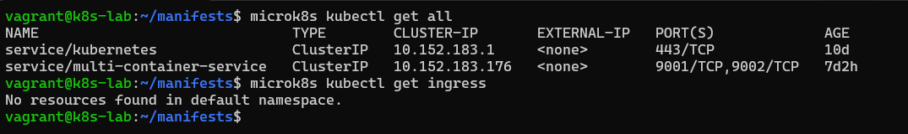

После удаления ресурсов предыдущей домашней работы в namespace `default` остался только стандартный Service `kubernetes`.

Перед началом работы с хранилищами также проверим отсутствие ранее созданных PersistentVolume, PersistentVolumeClaim и StorageClass:

```
microk8s kubectl get pv,pvc,storageclass
```

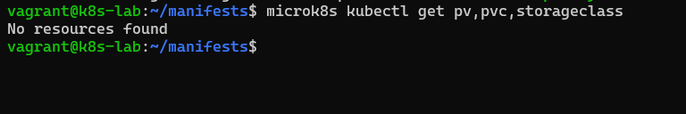

Ранее созданные `PersistentVolume`, `PersistentVolumeClaim` и `StorageClass` в кластере отсутствуют. Таким образом, кластер подготовлен к выполнению домашнего задания.

Создадим манифест `containers-data-exchange.yaml` следующего содержания:

```
apiVersion: apps/v1
kind: Deployment
metadata:
  name: data-exchange
spec:
  replicas: 1
  selector:
    matchLabels:
      app: data-exchange
  template:
    metadata:
      labels:
        app: data-exchange
    spec:
      containers:
        - name: busybox
          image: busybox:1.36
          imagePullPolicy: IfNotPresent
          command: ["/bin/sh", "-c"]
          args:
            - |
              while true; do
                echo "$(date)" >> /data/output.txt
                sleep 5
              done
          volumeMounts:
            - name: shared-data
              mountPath: /data

        - name: multitool
          image: wbitt/network-multitool:latest
          imagePullPolicy: IfNotPresent
          command: ["/bin/sh", "-c"]
          args:
            - "tail -f /data/output.txt"
          volumeMounts:
            - name: shared-data
              mountPath: /data

      volumes:
        - name: shared-data
          emptyDir: {}
```

Выполним проверку манифеста:

```
microk8s kubectl apply --dry-run=server -f containers-data-exchange.yaml
```

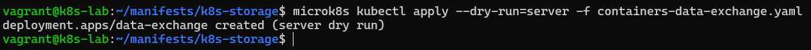


Применим манифест:

```
microk8s kubectl apply -f containers-data-exchange.yaml
```

Проверим Deployment и Pod:

```
microk8s kubectl get deployments
microk8s kubectl get pods -o wide
```

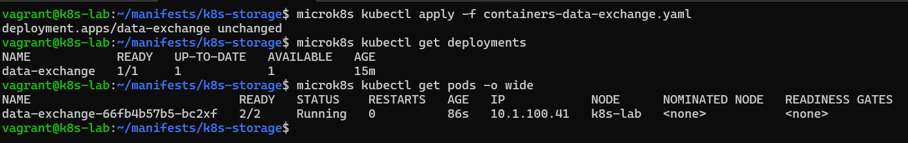

Deployment успешно создан. Pod `data-exchange` находится в состоянии `Running`, оба контейнера готовы к работе (`2/2`).

Сохраним имя Pod, чтобы в дальнейшем не вводить длинное имя:

```
POD=$(microk8s kubectl get pod -l app=data-exchange -o jsonpath='{.items[0].metadata.name}')
echo $POD
```

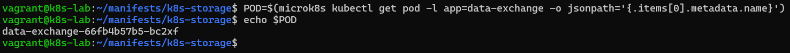

Прочитаем файл из контейнера `busybox`:

```
microk8s kubectl exec $POD -c busybox -- tail -n 5 /data/output.txt
```

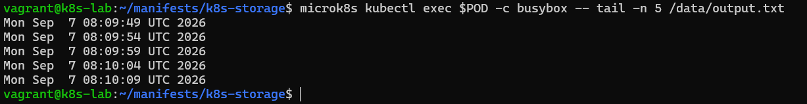

Прочитаем тот же файл из контейнера `multitool`:

```
microk8s kubectl exec $POD -c multitool -- tail -n 5 /data/output.txt
```

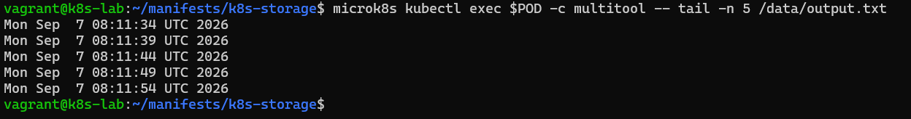

Выполним демонстрацию, необходимую по заданию:

```
microk8s kubectl exec $POD -c multitool -- tail -f /data/output.txt
```

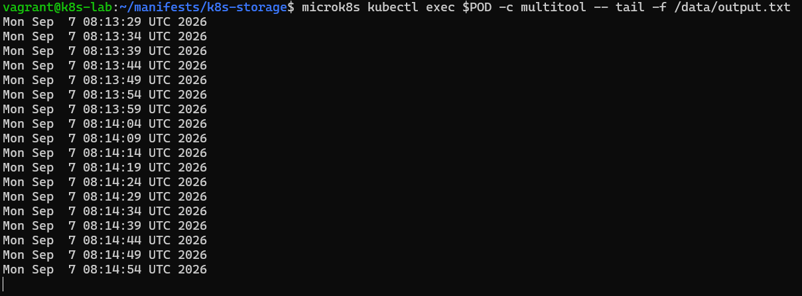

В выводе видно, что новые строки появляются примерно каждые 5 секунд. 
Таким образом, контейнер `busybox` каждые 5 секунд записывает данные в файл `/data/output.txt`, расположенный в общем Volume `shared-data` типа `emptyDir`. Контейнер `multitool` монтирует тот же Volume и успешно читает изменения файла в режиме реального времени.

Проверим конфигурацию Pod:

```
microk8s kubectl describe pod $POD
```
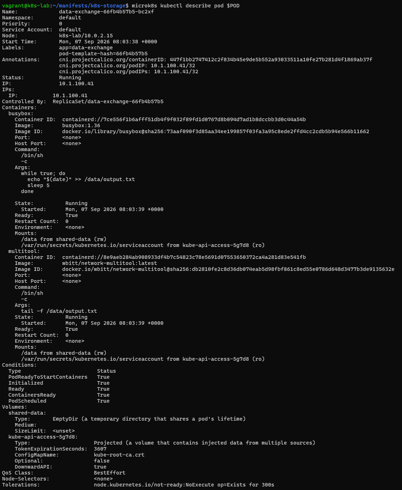

В выводе видно, что оба контейнера используют общий Volume:

```
Mounts:
  /data from shared-data (rw)
```

Сам Volume имеет тип `EmptyDir`:

```
Volumes:
  shared-data:
    Type: EmptyDir
```

Манифест: [containers-data-exchange.yaml](manifests/k8s-storage/containers-data-exchange.yaml)

## Задание 2. PV, PVC

Создать Deployment приложения, использующего локальный PV, созданный вручную.

## Решение 2

Удалим ресурсы первого задания:

```
microk8s kubectl delete -f containers-data-exchange.yaml
```
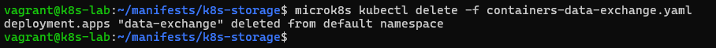

Проверим состояние:

```
microk8s kubectl get all
```

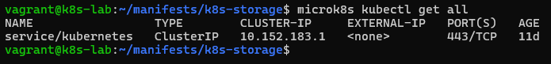

Cоздадим каталог на ноде для будущего PersistentVolume:

```
sudo mkdir -p /mnt/data
sudo chmod 777 /mnt/data
ls -ld /mnt/data
```

Проверим, что каталог пока пуст:

```
ls -la /mnt/data
```

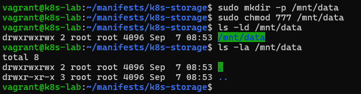

Создадим файл манифеста `pv-pvc.yaml` следующего содержания:

```
apiVersion: v1
kind: PersistentVolume
metadata:
  name: pv-data
spec:
  capacity:
    storage: 1Gi
  accessModes:
    - ReadWriteOnce
  persistentVolumeReclaimPolicy: Retain
  storageClassName: manual
  hostPath:
    path: /mnt/data
    type: Directory

---
apiVersion: v1
kind: PersistentVolumeClaim
metadata:
  name: pvc-data
spec:
  accessModes:
    - ReadWriteOnce
  storageClassName: manual
  resources:
    requests:
      storage: 1Gi

---
apiVersion: apps/v1
kind: Deployment
metadata:
  name: data-exchange-pv
spec:
  replicas: 1
  selector:
    matchLabels:
      app: data-exchange-pv
  template:
    metadata:
      labels:
        app: data-exchange-pv
    spec:
      containers:
        - name: busybox
          image: busybox:1.36
          imagePullPolicy: IfNotPresent
          command: ["/bin/sh", "-c"]
          args:
            - |
              while true; do
                echo "$(date)" >> /data/output.txt
                sleep 5
              done
          volumeMounts:
            - name: persistent-data
              mountPath: /data

        - name: multitool
          image: wbitt/network-multitool:latest
          imagePullPolicy: IfNotPresent
          command: ["/bin/sh", "-c"]
          args:
            - "tail -f /data/output.txt"
          volumeMounts:
            - name: persistent-data
              mountPath: /data

      volumes:
        - name: persistent-data
          persistentVolumeClaim:
            claimName: pvc-data
```

Выполним проверку манифеста:

```
microk8s kubectl apply --dry-run=server -f pv-pvc.yaml
```

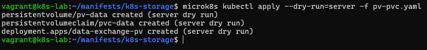

Применим манифест:

```
microk8s kubectl apply -f pv-pvc.yaml
```

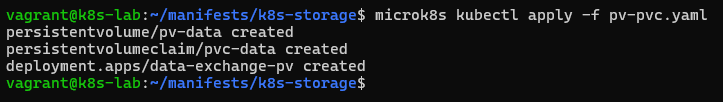

Посмотрим состояние PV и PVC:

```
microk8s kubectl get pv,pvc
```

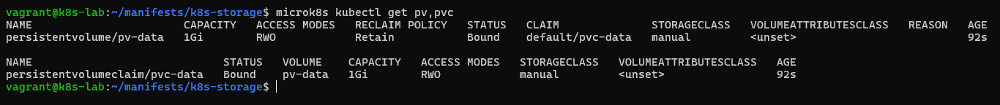

PersistentVolume `pv-data` и PersistentVolumeClaim `pvc-data` успешно связаны и находятся в состоянии `Bound`.

Проверим Deployment и Pod:

```
microk8s kubectl get deployments
microk8s kubectl get pods -o wide
```

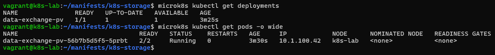

Сохраним имя нового Pod, чтобы в дальнейшем не вводить длинное имя:

```
POD=$(microk8s kubectl get pod -l app=data-exchange-pv -o jsonpath='{.items[0].metadata.name}')
echo $POD
```

Проверим файл через `multitool`:

```
microk8s kubectl exec $POD -c multitool -- tail -n 5 /data/output.txt
```

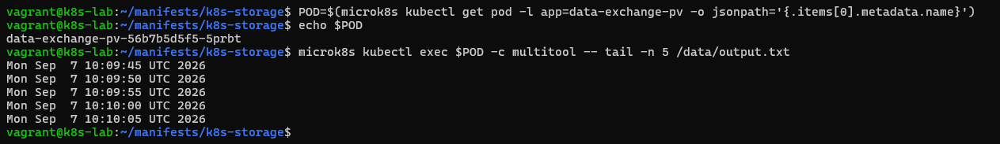

В первом задании для хранения данных использовался Volume типа `emptyDir`, жизненный цикл которого связан с Pod.

Во втором задании PersistentVolume `pv-data` использует `hostPath` `/mnt/data` на ноде `k8s-lab`. Поэтому данные физически записываются в каталог `/mnt/data` файловой системы ноды.

Выполним команды:

```
ls -lah /mnt/data
tail -n 5 /mnt/data/output.txt
```

В выводе увидим те же данные, что читали из контейнера:

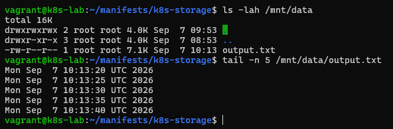

Удалим только Deployment:

```
microk8s kubectl delete deployment data-exchange-pv
```
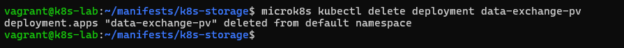

Проверим состояние ресурсов:

```
microk8s kubectl get all
microk8s kubectl get pv,pvc
```

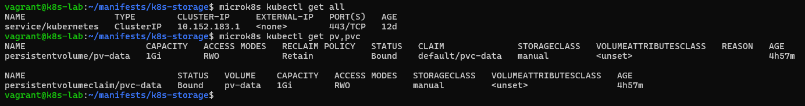

После удаления Deployment созданный Pod был удалён, при этом PersistentVolume и PersistentVolumeClaim сохранились и остались связанными.

Проверим наличие данных непосредственно на ноде:

```
ls -lah /mnt/data
tail -n 5 /mnt/data/output.txt
```

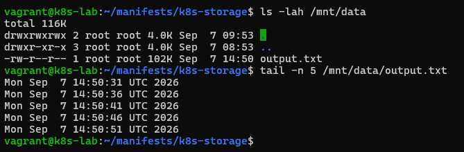

Файл `/mnt/data/output.txt` сохранился после удаления Deployment. При этом новые записи в файл больше не добавляются, поскольку Pod и контейнер `busybox`, выполнявший запись данных каждые 5 секунд, были удалены.

Таким образом, удаление Deployment и созданного им Pod не привело к удалению PersistentVolume, PersistentVolumeClaim и данных, находящихся в хранилище.

Удалим PersistentVolumeClaim `pvc-data`:

```
microk8s kubectl delete pvc pvc-data
```

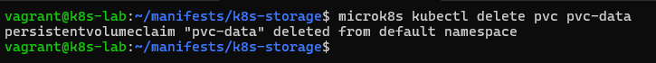


Посмотрим состояние PV и PVC:

```
microk8s kubectl get pv,pvc
```

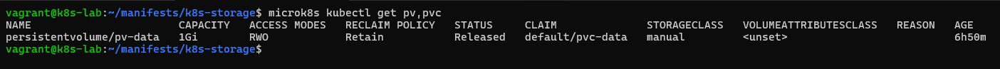

PersistentVolumeClaim `pvc-data` был удалён. PersistentVolume `pv-data` при этом сохранился, но перешёл из состояния `Bound` в состояние `Released`.

Это связано с установленной для PV политикой освобождения:

```
persistentVolumeReclaimPolicy: Retain
```

При политике `Retain` после удаления связанного PVC PersistentVolume переходит в состояние `Released`, а данные в связанном хранилище не удаляются автоматически.

Проверим сохранность файла непосредственно на ноде:

```
ls -lah /mnt/data
tail -n 5 /mnt/data/output.txt
```

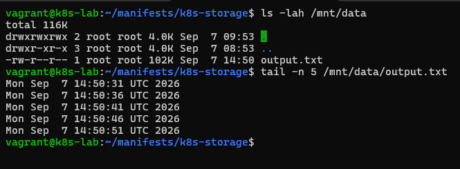

Несмотря на удаление PVC, файл `/mnt/data/output.txt` и записанные в него данные сохранились в каталоге `/mnt/data` на ноде.

Для более подробной проверки состояния PersistentVolume выполним:

```
microk8s kubectl describe pv pv-data
```

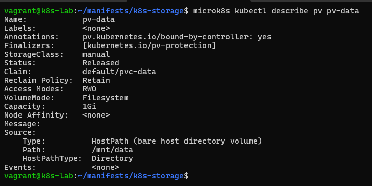

В выводе видно, что PersistentVolume находится в состоянии `Released`, при этом сохраняется информация о ранее использовавшем его PVC:

```
Status:          Released
Claim:           default/pvc-data
Reclaim Policy:  Retain
```

Также видно, что PV использует локальный каталог `/mnt/data` на ноде:

```
Source:
  Type:          HostPath
  Path:          /mnt/data
```

Состояние `Released` означает, что связанный с PV PersistentVolumeClaim был удалён, однако сам PersistentVolume ещё не был повторно предоставлен для использования. Благодаря политике `Retain` данные в хранилище сохраняются после удаления PVC.

Удалим объект PV:

```
microk8s kubectl delete pv pv-data
```

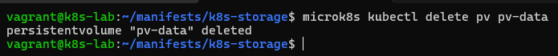

Посмотрим состояние PV и PVC:

```
microk8s kubectl get pv,pvc
```

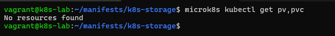

Проверим сохранность файла непосредственно на ноде:

```
ls -lah /mnt/data
tail -n 5 /mnt/data/output.txt
```

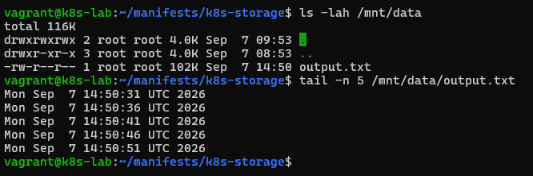

После удаления PersistentVolume объект `pv-data` больше не существует в Kubernetes, однако файл `/mnt/data/output.txt` и записанные в него данные сохранились на файловой системе ноды.

Это связано с тем, что PersistentVolume использовал локальный каталог ноды через `hostPath`:

```
Source:
  Type: HostPath
  Path: /mnt/data
```

Удаление объекта PersistentVolume из Kubernetes удаляет описание хранилища из API кластера, но не удаляет сам каталог `/mnt/data` и находящиеся в нём файлы.

Таким образом, в данном случае данные сохранились даже после последовательного удаления Deployment, PVC и PV.

Манифест: [pv-pvc.yaml](manifests/k8s-storage/pv-pvc.yaml)

