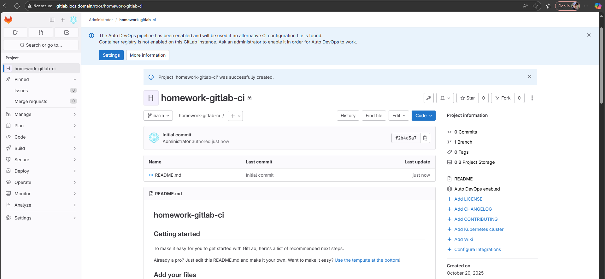
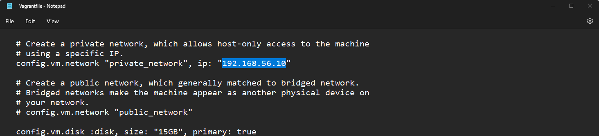
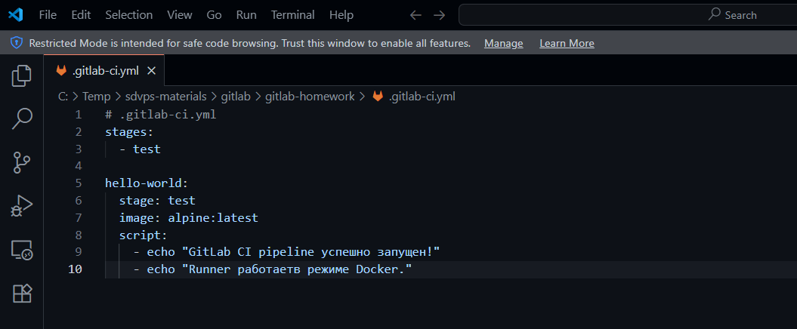
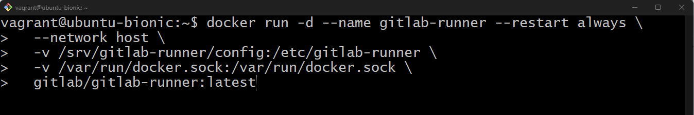

# Домашнее задание по теме "Система мониторинга Zabbix" Ячмень Марк Викторович

## Задание 1

**Установите Zabbix Server с веб-интерфейсом.**

1. Выполняя ДЗ, сверяйтесь с процессом отражённым в записи лекции.
2. Установите PostgreSQL. Для установки достаточна та версия, что есть в системном репозитороии Debian 11.
3. Пользуясь конфигуратором команд с официального сайта, составьте набор команд для установки последней версии Zabbix с поддержкой PostgreSQL и Apache.
4. Выполните все необходимые команды для установки Zabbix Server и Zabbix Web Server.

**Требования к результатам**

1. Прикрепите в файл README.md скриншот авторизации в админке.
2. Приложите в файл README.md текст использованных команд в GitHub.

## Решение 1

Для выполнения задания выполним следующие действия.

Установим БД PostgreSQL:

Запустим и включим службу postgresql:

Создадим базу данных и пользователя для Zabbix:

Установим репозиторий Zabbix:

Установим Zabbix Server, Web UI и Agent 2:

Импортируем структуру и начальные данные в БД 'zabbix':

Настроим подключение к БД:

Запустим и включим службы Zabbix:

Проверим, что службы работают:

Проверим, что Zabbix слушает порт:

Откроем браузер и перейдем по адресу web-панели Zabbix:

Произведём первоначальную настройку:

После окончания настройки мы можем аутентифицироваться и войти в систему:

