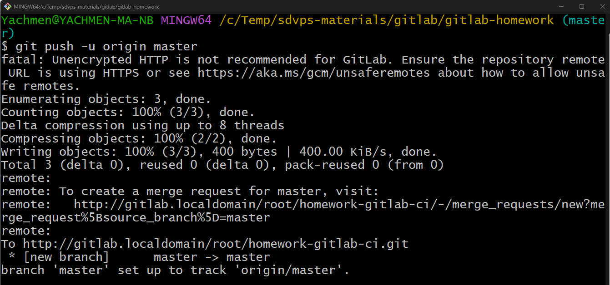

# Домашнее задание по теме "GitLab"

## Задание 1

1. Разверните GitLab локально, используя Vagrantfile и инструкцию, описанные в этом репозитории.
2. Создайте новый проект и пустой репозиторий в нём.
3. Зарегистрируйте gitlab-runner для этого проекта и запустите его в режиме Docker. Раннер можно регистрировать и запускать на той же виртуальной машине, на которой запущен GitLab.

В качестве ответа в репозиторий шаблона с решением добавьте скриншоты с настройками раннера в проекте.

## Решение 1

Для выполнения задания выполним следующие действия.

Установим Vagrant на свой компьютер:

Склонируем репозиторий с домашним заданием с GitHub себе на компьютер:

Отредактируем файл hosts у себя на компьютере. Добавим в него строку *192.168.56.10 gitlab.localdomain gitlab*:

Эта информация взята из Vagrantfile:

Запускаем Vagrant для создания виртуальной машины в VirtualBox. Для этого в консоли Git Bash выполняем команду *VAGRANT_EXPERIMENTAL="disks" vagrant up*:

После окончания процесса создания виртуальной машины нам нужно узнать пароль от root в GitLab.  Для этого выполним следующие команды.

Подключимся к созданной виртуальной машине с помощью команды *vagrant ssh*:

Выведем пароль в консоль командой *sudo cat /etc/gitlab/initial_root_password*:

