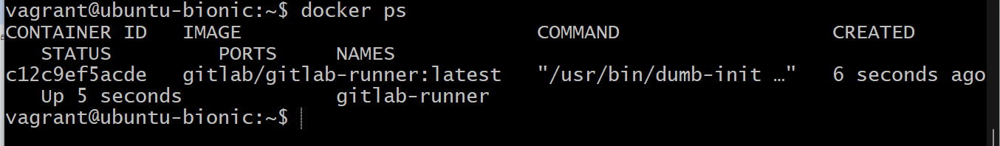
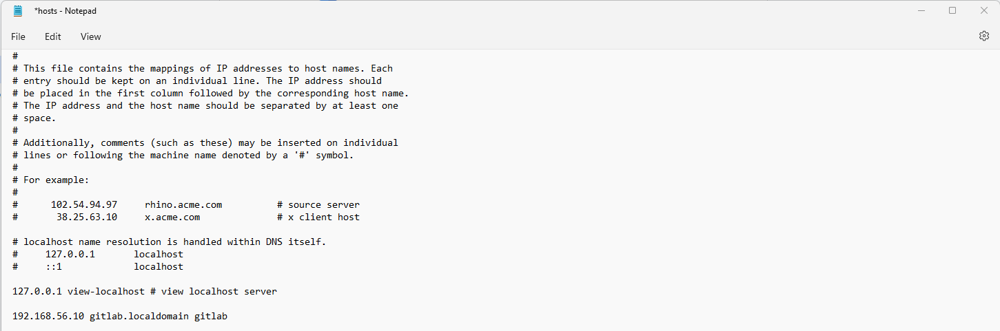

# Домашнее задание по теме "GitLab" Ячмень Марк Викторович

## Задание 1

 - Запустите два simple python сервера на своей виртуальной машине на разных портах
 - Установите и настройте HAProxy, воспользуйтесь материалами к лекции по ссылке
 - Настройте балансировку Round-robin на 4 уровне.
 - На проверку направьте конфигурационный файл haproxy, скриншоты, где видно перенаправление запросов на разные серверы при обращении к HAProxy.

## Решение 1

Для выполнения задания выполним следующие действия.

Создадим два разных файла index.html, чтобы с помощью их отображения различать python сервера между собой:

Запустим два simple python сервера на разных портах:

Проверим в браузере, что оба сервера отвечают:

Установим HAProxy:

Откроем и отредактируем конфигурационный файл HAProxy:

Перезапустим сервис HAProxy и проверим его состояние:

Для проверки работы алгоритма балансировки выполним несколько запросовк адресу  http://localhost.
В ответах мы увидим, что отвечают разные сервера:

В репозитории представлен [конфигурационный файл](haproxy.cfg) HAProxy.

## Задание 2

Что нужно сделать:

1. Запушьте репозиторий на GitLab, изменив origin. Это изучалось на занятии по Git.
2. Создайте .gitlab-ci.yml, описав в нём все необходимые, на ваш взгляд, этапы.

В качестве ответа в шаблон с решением добавьте:

* файл gitlab-ci.yml для своего проекта или вставьте код в соответствующее поле в шаблоне;
* скриншоты с успешно собранными сборками.

## Решение 2

Для выполнения задания подготовим локальный репозиторий.
Для этого в консоли выполним команды:

В созданной папке создадим файл .gitlab-ci.yml со следующим содержанием:

Теперь выполним push локального репозитория в репозиторий GitLab:

После этого перейдём в web-интерфейс GitLab и увидим, что job выполнился:

В логах можем увидеть сообщение об успешном запуске:

