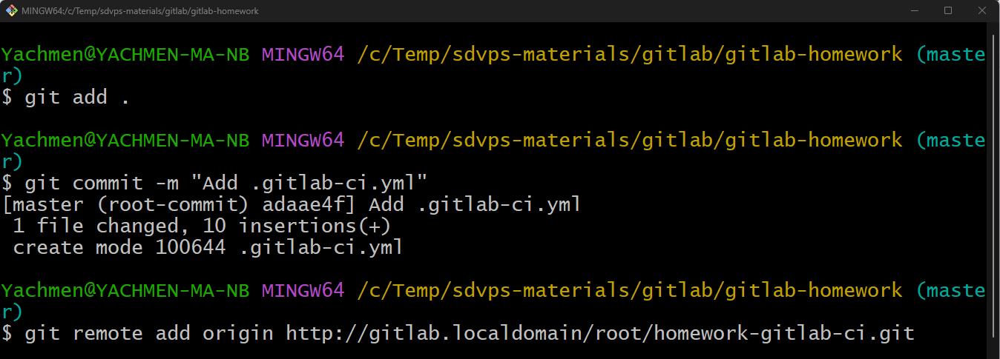
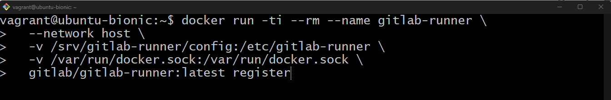
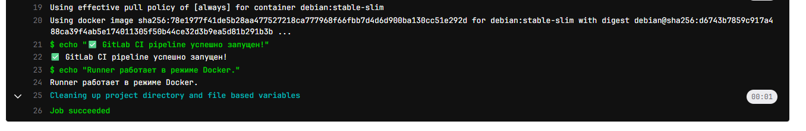
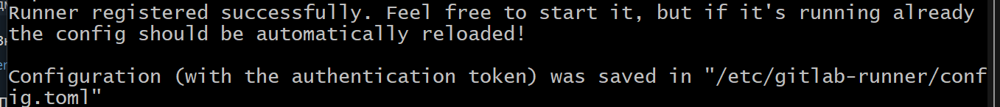

# Домашнее задание по теме "Disaster recovery и Keepalived" Ячмень Марк Викторович

## Задание 1

 - Дана схема для Cisco Packet Tracer, рассматриваемая в лекции.
 - На данной схеме уже настроено отслеживание интерфейсов маршрутизаторов Gi0/1 (для нулевой группы)
 - Необходимо аналогично настроить отслеживание состояния интерфейсов Gi0/0 (для первой группы).
 - Для проверки корректности настройки, разорвите один из кабелей между одним из маршрутизаторов и Switch0 и запустите ping между PC0 и Server0.
 - На проверку отправьте получившуюся схему в формате pkt и скриншот, где виден процесс настройки маршрутизатора.

## Решение 1

Для выполнения задания выполним следующие действия.

Откроем в Cisco Packet Tracer предложенную схему:

Откроем командную строку маршрутизатора Router1 и приступим к редактированию конфигурации:

Теперь отредактируем конфигурацию на маршрутизаторе Router2:

Для проверки работоспособности наших настроек мы разорвём связь между компьютером PC0 и маршрутизатором Router1:

Запустим команду ping на компьютере PC0 до IP адреса сервера Server0:

Так же работу можно проверить в режиме симуляции:

[Файл](hw_lan.pkt) со схемой (.pkt)

## Задание 2

 - Запустите две виртуальные машины Linux, установите и настройте сервис Keepalived как в лекции, используя пример конфигурационного файла.
 - Настройте любой веб-сервер (например, nginx или simple python server) на двух виртуальных машинах
 - Напишите Bash-скрипт, который будет проверять доступность порта данного веб-сервера и существование файла index.html в root-директории данного веб-сервера.
 - Настройте Keepalived так, чтобы он запускал данный скрипт каждые 3 секунды и переносил виртуальный IP на другой сервер, если bash-скрипт завершался с кодом, отличным от нуля (то есть порт веб-сервера был недоступен или отсутствовал index.html). Используйте для этого секцию vrrp_script
 - На проверку отправьте получившейся bash-скрипт и конфигурационный файл keepalived, а также скриншот с демонстрацией переезда плавающего ip на другой сервер в случае недоступности порта или файла index.html

## Решение 2

Для выполнения задания выполним следующие действия.

Установим иеб-сервер nginx:

Запустим службу и включим автозапуск слубы:

Аналогичные действия выполним и на втором сервере.

Проверим, что файл index.html существует в директории веб-сервера:

Создадим Bash-скрипт в соответствии с требованиями задания:

Аналогичный скрипт создадим на втором сервере.

Установим Keepalived на обоих серверах:

Внесём изменени в конфигурационные файлы Keepalived на обоих серверах:

Перезапустим сервис Keepalived:

Проверим статус сервиса Keepalived:

Проверим наличие Virtual IP на MASTER сервере:

Откроем Virtual IP в браузерах на обоих серверах и увидим, что везде отвечает веб-сервер с MASTER сервера:

Чтобы проверить переключение на BACKUP сервер, выполним следующие действия.

На MASTER сервере переименуем файл index.html:

Обновим в браузере на обоих серверах страницу и увидим, что теперь отвечает BACKUP сервер:

В репозитории представлены файлы:

[Конфигурационный файл](MASTER_keepalived.conf) Keepalived MASTER сервера

[Конфигурационный файл](BACKUP_keepalived.conf) Keepalived BACKUP сервера

[Bash-скрипт](check_web.sh)