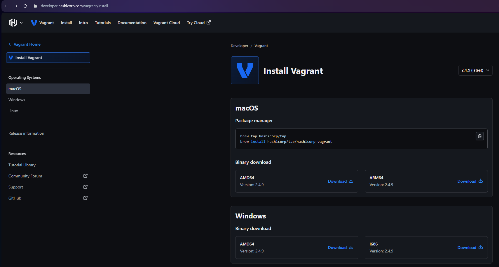
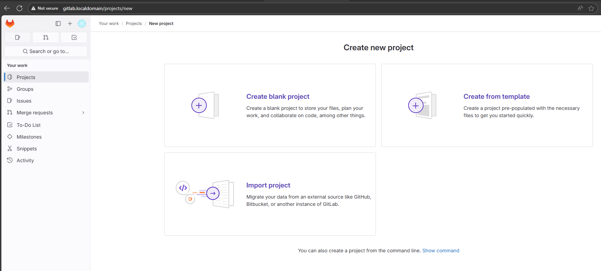

# Домашнее задание по теме "GitLab" Ячмень Марк Викторович

## Задание 1

 - Запустите два simple python сервера на своей виртуальной машине на разных портах
 - Установите и настройте HAProxy, воспользуйтесь материалами к лекции по ссылке
 - Настройте балансировку Round-robin на 4 уровне.
 - На проверку направьте конфигурационный файл haproxy, скриншоты, где видно перенаправление запросов на разные серверы при обращении к HAProxy.

## Решение 1

Для выполнения задания выполним следующие действия.

Создадим два разных файла index.html, чтобы с помощью их отображения различать python сервера между собой:

Запустим два simple python сервера на разных портах:

Проверим в браузере, что оба сервера отвечают:

Установим HAProxy:

Откроем и отредактируем конфигурационный файл HAProxy:

Перезапустим сервис HAProxy и проверим его состояние:

Для проверки работы алгоритма балансировки выполним несколько запросовк адресу  http://localhost.
В ответах мы увидим, что отвечают разные сервера:

В репозитории представлен [конфигурационный файл](L4_haproxy.cfg) HAProxy.

## Задание 2

 - Запустите три simple python сервера на своей виртуальной машине на разных портах
 - Настройте балансировку Weighted Round Robin на 7 уровне, чтобы первый сервер имел вес 2, второй - 3, а третий - 4
 - HAproxy должен балансировать только тот http-трафик, который адресован домену example.local
 - На проверку направьте конфигурационный файл haproxy, скриншоты, где видно перенаправление запросов на разные серверы при обращении к HAProxy c использованием домена example.local и без него.

## Решение 2

Для выполнения задания выполним следующие действия.

Переделаем файлы index.html, предназначенные для работы python серверов:

Запустим три simple python сервера на разных портах:

Произведём настройку домена example.com.
Для этого добавим его в файл /etc/hosts:

Отредактируем файл конфигурации HAProxy для работы с балансировкой Weighted Round Robin на 7 уровне:

Перезапустим сервис HAProxy и проверим его статус:

Для проверки работы алгоритма балансировки выполним несколько запросов к адресу http://example.local
и посчитаем как часто нам отвечает тот или иной сервер:

Из вывода мы видим, что Server3 отвечал 7 раз из 15 запросов, Server2 - 5 раз и Server1 - 3 раза, 
что как раз и соответствует присвоенным весам.

В том случае, если запрос не будет содержать имени , то будет возвращена 404 ошибка:

В репозитории представлен [конфигурационный файл](L7_haproxy.cfg) HAProxy.

