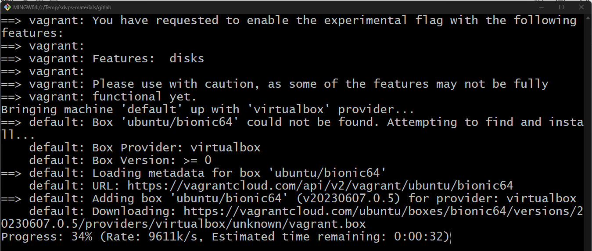

# Домашнее задание по теме "GitLab"

## Задание 1

1. Разверните GitLab локально, используя Vagrantfile и инструкцию, описанные в этом репозитории.
2. Создайте новый проект и пустой репозиторий в нём.
3. Зарегистрируйте gitlab-runner для этого проекта и запустите его в режиме Docker. Раннер можно регистрировать и запускать на той же виртуальной машине, на которой запущен GitLab.

В качестве ответа в репозиторий шаблона с решением добавьте скриншоты с настройками раннера в проекте.

## Решение 1

Для выполнения задания выполним следующие действия.

Установим Vagrant на свой компьютер:

Склонируем репозиторий с домашним заданием с GitHub себе на компьютер:

Отредактируем файл hosts у себя на компьютере. Добавим в него строку *192.168.56.10 gitlab.localdomain gitlab*:

Эта информация взята из Vagrantfile:

Запускаем Vagrant для создания виртуальной машины в VirtualBox. Для этого в консоли Git Bash выполняем команду *VAGRANT_EXPERIMENTAL="disks" vagrant up*:

После окончания процесса создания виртуальной машины нам нужно узнать пароль от root в GitLab.  Для этого выполним следующие команды.

Подключимся к созданной виртуальной машине с помощью команды *vagrant ssh*:

Выведем пароль в консоль командой *sudo cat /etc/gitlab/initial_root_password*:

В браузере откроем страницу по адресу http://gitlab.localdomain/ и увидим, что GitLab установлен и работает.
Зайдём в систему с логином root и паролем, который мы получили на предыдущем шаге:

Теперь создадим свой проект в GitLab. Для этого в web-интерфейсе нажмём “New project”, а затем “Create blank project”:

Заполним поле Project name и нажмём Create project:

Зарегистрируем gitlab-runner. Для этого в консоли, которая подключена к виртуальной машине с GitLab, выполним команду:

и заполним запрашиваемые параметры:

После регистрации запустим gitlab-runner выполнив команду:

Проверим, что runner запущен:

Также мы можем увидеть запущенный runner в web-интерфейсе GitLab:

## Задание 2

Что нужно сделать:

1. Запушьте репозиторий на GitLab, изменив origin. Это изучалось на занятии по Git.
2. Создайте .gitlab-ci.yml, описав в нём все необходимые, на ваш взгляд, этапы.

В качестве ответа в шаблон с решением добавьте:

* файл gitlab-ci.yml для своего проекта или вставьте код в соответствующее поле в шаблоне;
* скриншоты с успешно собранными сборками.

## Решение 2

Для выполнения задания подготовим локальный репозиторий.
Для этого в консоли выполним команды:

В созданной папке создадим файл .gitlab-ci.yml со следующим содержанием:

Теперь выполним push локального репозитория в репозиторий GitLab:

После этого перейдём в web-интерфейс GitLab и увидим, что job выполнился:

В логах можем увидеть сообщение об успешном запуске:

