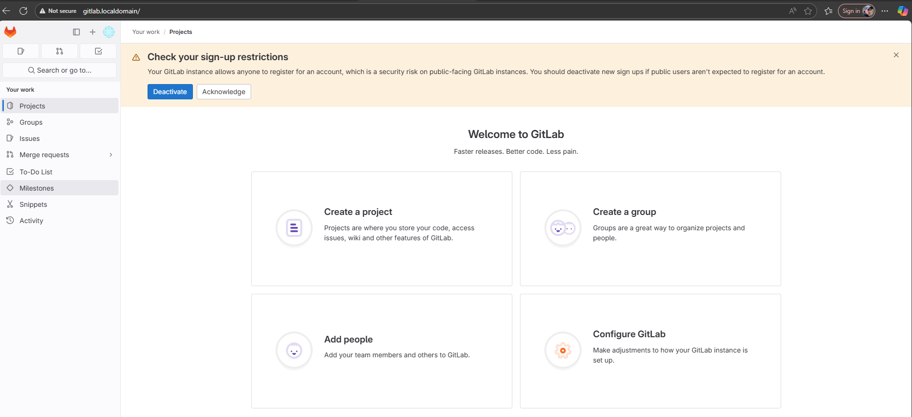
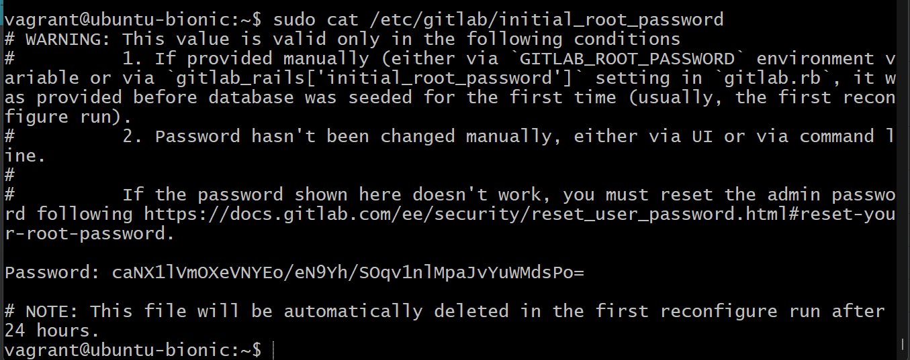

# Домашнее задание по теме "Резервное копирование" Ячмень Марк Викторович

## Задание 1

 - Составьте команду rsync, которая позволяет создавать зеркальную копию домашней директории пользователя в директорию */tmp/backup*
 - Необходимо исключить из синхронизации все директории, начинающиеся с точки (скрытые)
 - Необходимо сделать так, чтобы rsync подсчитывал хэш-суммы для всех файлов, даже если их время модификации и размер идентичны в источнике и приемнике.
 - На проверку направить скриншот с командой и результатом ее выполнения

## Решение 1

Для выполнения задания выполним следующие действия.

Создадим директорию в которую будем бекапить наши файлы:

Для бекапа будем использовать следующую команду:

в которой:

 - *-a* — архивный режим: рекурсивно копирует всё содержимое, сохраняя права, владельца, временные метки и т.д.
 - *-v* — подробный вывод (показывает, какие файлы копируются).
 - *--delete* — удаляет файлы в приёмнике (/tmp/backup), которых больше нет в источнике ($HOME). Это делает копию «зеркальной».
 - *--exclude='.*'* — исключает все файлы и папки, имя которых начинается с точки (например, .bashrc, .config, .ssh и т.д.).
 - *--checksum* — заставляет rsync сравнивать файлы по контрольной сумме (хэш-сумме), а не по размеру и времени модификации.
 - *$HOME/* — источник 
 - */tmp/backup/* — целевая директория для резервной копии.

Результат выполнения команды:

Содержимое папки с бекапом:

## Задание 2

 - Написать скрипт и настроить задачу на регулярное резервное копирование домашней директории пользователя с помощью rsync и cron.
 - Резервная копия должна быть полностью зеркальной
 - Резервная копия должна создаваться раз в день, в системном логе должна появляться запись об успешном или неуспешном выполнении операции
 - Резервная копия размещается локально, в директории /tmp/backup
 - На проверку направить файл crontab и скриншот с результатом работы утилиты.

## Решение 2

Для выполнения задания выполним следующие действия.

Создадим скрипт, который будет выполнять бекап файлов в соответствии с заданием:

Сделаем файл скрипта исполняемым:

Теперь выполним настройку Cron.
Откроем файл crontab:

Добавим в файл следующую строку, которая будет соответствовать запуску скрипта по расписанию. указанному в задании:

Для того, чтобы не ждать выполнения скрипта по указанному расписанию, добавим в Cron ещё одну строку, которая будет запускать скрипт каждую минуту:

Очистим папку с бекапом:

Дождёмся выполнения скрипта бекапа по расписанию и проверим содержимое папки:

После этого проверим, что запись появилась в системном журнале: 

